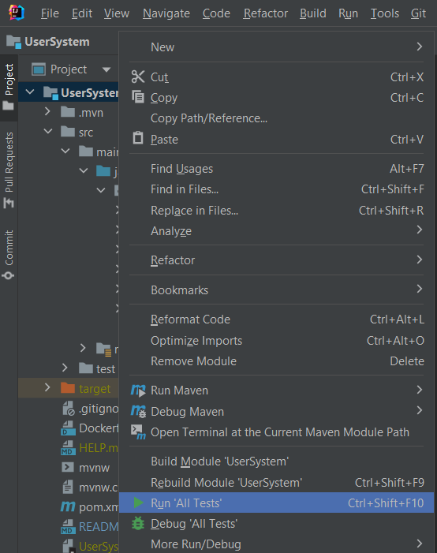
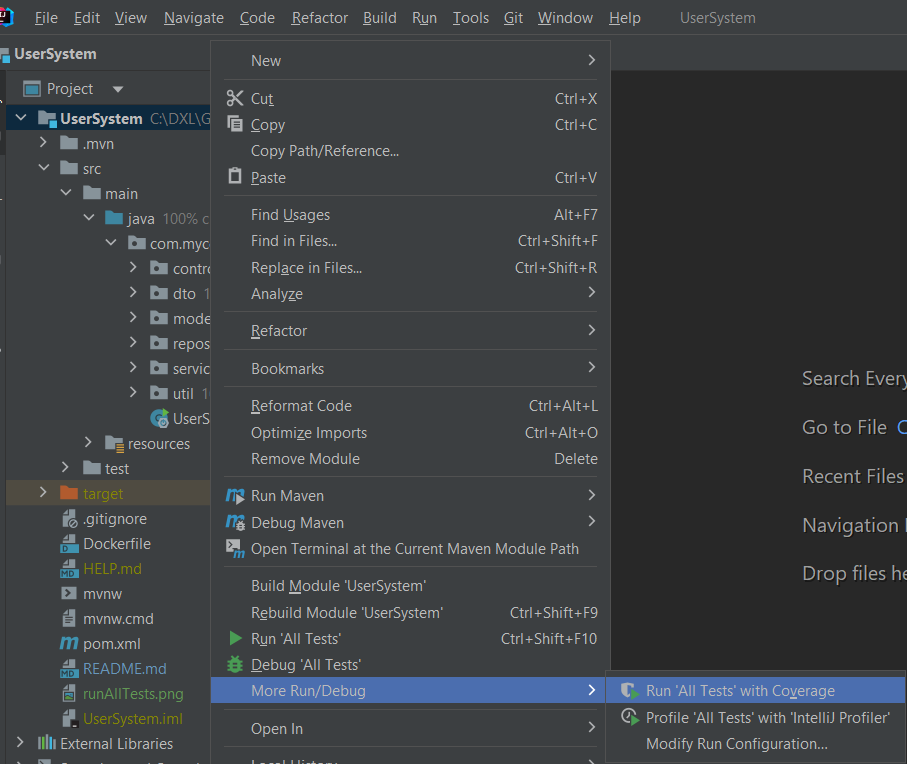

## User System
This Application help admin to add, delete user and show all users' info.
The application also allow users to submit requests to DB by validating 
the user's request and save his data into DataBase.

- The project has two controllers "UserController" and "UserFlowController".
  - UserController is responsible for CRUD operations of the user (Add, get, getAll and delete user).
  - UserFlowController is responsible for allowing user to submit his requests.

#### NOTES:
- to execute the unit test run:
  - Right click on application the click on "Run 'All tests'".
  - 
- to execute the unit test with coverage:
  - Right click on application the click on "More Run/Debug" then choose "Run 'All tests' with coverage".
  - 

### The application contains the below operations:
#### User CRUD OPERATIONS:
- GET User by Civil ID.
- GET All Users.
- Add User
- Delete User
- Submit Request

### APIS

##### GET USER BY CivilID
````
curl --location --request GET 'http://localhost:8080/user/get?civilId=1'
````
##### GET All Users

````
curl --location --request GET 'http://localhost:8080/user/getAll'
````


##### ADD User
````
curl --location --request POST 'http://localhost:8080/user/add' \
--header 'Content-Type: application/json' \
--data-raw '{
"civilId" : 1,
"name":"test",
"expiryDate":"2020-10-21 10:00:00"
}'
````

#### Delete User By civil ID

```
curl --location --request GET 'http://localhost:8080/user/delete?civilId=2'
```

#### Submit request
````
curl --location --request POST 'localhost:8080/request/submit' \
--header 'Content-Type: application/json' \
--data-raw '{
    "name": "",
    "status": "ACCEPTED",
    "attachmentList": [
        {
            "name": "1"
        },
        {
            "name": "12"
        }
    ],
    "user": {
        "civilId": "2"
    }
}'
````
